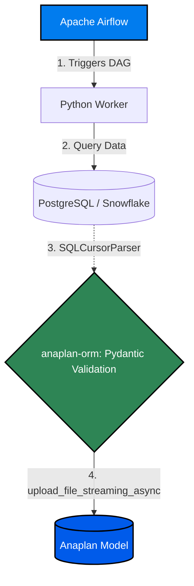
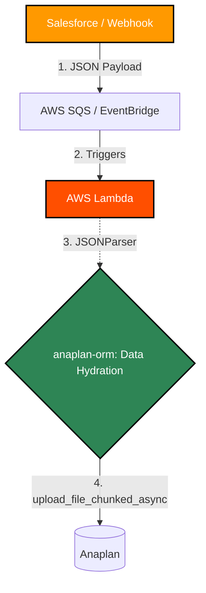
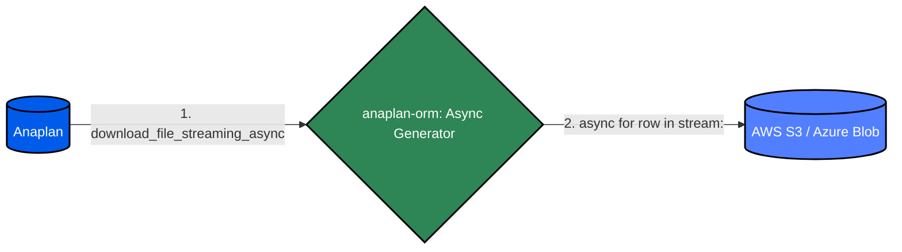

# anaplan-orm


A lightweight Python 3 library that abstracts the Anaplan API into an Object-Relational Mapper (ORM).

## Current Status
🚀 **Active Beta (v0.4.0)** 🚀
Core data transformation, parsing engine, chunked Anaplan API client, and custom strict-type validators are complete.

## 🌟 Features
* **Pydantic Data Ingestion:** Validates and maps Python objects to Anaplan models effortlessly.
* **Custom Anaplan Types:** Built-in `AnaplanDate` and `AnaplanBoolean` automatically sanitize and strictly format Python native types (like `datetime.date` or `True/False`) into the exact string formats required by Anaplan's API.
* **Enterprise Security:** Supports standard Basic Authentication and Anaplan's proprietary RSA-SHA512 Certificate-based Authentication (mTLS).
* **Resilient Networking:** Built-in exponential backoff, automated retries to protect against dropped packets, and mid-flight authentication token refreshing for massive, long-running pipelines.
* **Massive Payloads:** Automatically handles chunked file uploads for multi-megabyte/gigabyte datasets without memory crashes.
* **Infinite Disk Streaming (Uploads):** Utilizes `aiofiles` and an asynchronous bounded Producer-Consumer queue to stream multi-gigabyte files directly from disk to Anaplan with a flat, near-zero memory footprint.
* **Async Generators (Downloads):** Safely extracts and buffers multi-gigabyte files out of Anaplan row-by-row, eliminating Out of Memory (OOM) crashes during massive data extractions.
* **Smart Polling:** Asynchronous process execution with configurable, patient polling for long-running database transactions.

---

## 🗺️ Architecture: Where does `anaplan-orm` sit?

`anaplan-orm` is designed to be the strongly-typed "bridge" between your modern data orchestrators and the Anaplan API. It operates in both schedule-driven batch processes and event-driven serverless architectures.

### Architecture A: The Scheduled Pipeline (Airflow / Prefect)
In a traditional ELT pipeline, orchestrators trigger a Python worker to query a database. `anaplan-orm` strictly validates that SQL data in-memory and streams it to Anaplan.



### Architecture B: The Serverless Event Stream (AWS Lambda)
For real-time integrations, external systems drop JSON/XML payloads into a message queue. A serverless function picks up the payload, and anaplan-orm handles the validation and chunked upload without ever touching a hard drive.



### Architecture C: The Massive Data Extract (Data Lake)
When backing up Anaplan models or feeding downstream BI tools, anaplan-orm acts as a memory-safe conduit, streaming multi-gigabyte files row-by-row directly into cloud storage.



---

## 🔐 Authentication

`anaplan-orm` uses a decoupled authentication strategy, allowing you to easily swap between development and production security standards.

### 1. Basic Authentication
Ideal for development and sandbox testing.

```python
from anaplan_orm.client import AnaplanClient
from anaplan_orm.authenticator import BasicAuthenticator

auth = BasicAuthenticator("your_email@company.com", "your_password")
client = AnaplanClient(authenticator=auth)
```

### 2. Certificate-Based Authentication (Enterprise Standard)

For production environments, Anaplan requires a custom RSA-SHA512 signature. The CertificateAuthenticator handles this cryptographic handshake automatically.

Note: The library expects a .pem file containing both your private key and public certificate. If your enterprise issues a .p12 keystore, you can extract it using your terminal:

```bash
openssl pkcs12 -in keystore.p12 -out certificate.pem
```

```python
from anaplan_orm.client import AnaplanClient
from anaplan_orm.authenticator import CertificateAuthenticator

# 1. Initialize the Certificate Authenticator
auth = CertificateAuthenticator(
    cert_path="path/to/your/certificate.pem",
    # Omit if your private key is unencrypted
    cert_password="your_secure_password", 
    # Set to False if you need to bypass a corporate proxy
    verify_ssl=True
)

# 2. Inject it into the Anaplan Client
client = AnaplanClient(authenticator=auth)

# 3. Execute a request
status = client.ping()
```
---

## 📊 Quick Start: XML Parsing & Data Upload
The `anaplan-orm` is designed to take raw XML strings (e.g., from MuleSoft or data pipeline payloads), validate them into Python objects, and stream them directly into Anaplan.

### 1. Define Your Model
Map your Anaplan target columns to Python using Pydantic fields. The `alias` parameter bridges the gap between external uppercase XML tags and internal Python `snake_case` variables. 

```python
from pydantic import Field
from anaplan_orm.models import AnaplanModel

class Developer(AnaplanModel):
    dev_id: int = Field(alias="DEV_ID")
    dev_name: str = Field(alias="DEV_NAME")
    dev_age: int = Field(alias="DEV_AGE")
    dev_location: str = Field(alias="DEV_LOCATION")
```

### 2. Parse, Serialize, and Upload
Use the XMLStringParser to ingest your XML string payload, then use the AnaplanClient to stream the chunked data to Anaplan.

```python
from anaplan_orm.parsers import XMLStringParser
from anaplan_orm.client import AnaplanClient, BasicAuthenticator

# 1. Your incoming XML string payload
xml_string = """
<AnaplanExport>
    <Row>
        <DEV_ID>1001</DEV_ID>
        <DEV_NAME>Ada Lovelace</DEV_NAME>
        <DEV_AGE>36</DEV_AGE>
        <DEV_LOCATION>London</DEV_LOCATION>
    </Row>
</AnaplanExport>
"""

def run_pipeline():
    # 2. Parse and Validate the data using the ORM
    parser = XMLStringParser()
    developers = Developer.from_payload(payload=xml_string, parser=parser)
    
    # 3. Serialize to Anaplan-ready CSV (using a Pipe separator)
    csv_data = Developer.to_csv(developers, separator="|")

    # 4. Authenticate with Anaplan
    auth = BasicAuthenticator(
        email="ANAPLAN_EMAIL", 
        pwd="ANAPLAN_PASSWORD"
    )

    client = AnaplanClient(authenticator=auth)

    # 5. Stream the file chunks safely
    client.upload_file_chunked(
        workspace_id="YOUR_WORKSPACE_ID", 
        model_id="YOUR_MODEL_ID", 
        file_id="YOUR_FILE_ID", 
        csv_data=csv_data,
        chunk_size_mb=10
    )

    # 6. Execute the Import Process
    task_id = client.execute_process(
        workspace_id="YOUR_WORKSPACE_ID", 
        model_id="YOUR_MODEL_ID", 
        process_id="YOUR_PROCESS_ID"
    )
    
    # 7. Actively poll the database for success/failure
    status = client.wait_for_process_completion(
        workspace_id="YOUR_WORKSPACE_ID", 
        model_id="YOUR_MODEL_ID", 
        process_id="YOUR_PROCESS_ID", 
        task_id=task_id
    )

if __name__ == "__main__":
    run_pipeline()
```
---

## 📤 Upload Strategies (Which one should I use?)

`anaplan-orm` provides four distinct methods for streaming data into Anaplan. Whether you are uploading a tiny configuration table or a 10-Gigabyte daily transaction ledger, there is a method optimized for your pipeline.

### 1. The Fast Path (upload_file)
**Best for:** Small datasets, dimension updates, or configuration files (**< 10 MB**).
**How it works:** Executes a single, synchronous `PUT` request. It has zero overhead and is the absolute fastest way to get small amounts of data into Anaplan.

```python
# Uploads the entire CSV in one shot
client.upload_file(
    workspace_id="YOUR_WORKSPACE_ID", 
    model_id="YOUR_MODEL_ID", 
    file_id="YOUR_FILE_ID", 
    csv_data=csv_data
)
```

### 2. The Heavy Lifter (upload_file_chunked)
**Best for:** Medium-to-Large datasets (10 MB - 100 MB) or pipelines running in strictly synchronous environments.
**How it works:** Synchronously splits your CSV string into pieces (chunks) and uploads them one by one. This bypasses Anaplan's single-request timeout limits and guarantees safe delivery over unstable networks by retrying failed chunks individually.

```python
# Uploads sequentially, one 10MB chunk at a time
client.upload_file_chunked(
    workspace_id="YOUR_WORKSPACE_ID", 
    model_id="YOUR_MODEL_ID", 
    file_id="YOUR_FILE_ID", 
    csv_data=csv_data,
    chunk_size_mb=10 
)
```

### 3. The Turbocharger (upload_file_chunked_async) 🚀
**Best for:** Large Datasets already stored in memory (100 MB - 500 MB).
**How it works:** Utilizes Python's asyncio to blast multiple file chunks to the Anaplan server simultaneously from a loaded Python string. It includes a built-in Semaphore (default: 5 concurrent connections) to completely saturate your network bandwidth without triggering Anaplan's 429 Too Many Requests rate limits.

*Note: For files larger than 500MB, we recommend increasing the `chunk_size_mb` to 25 or 50 to reduce HTTP overhead. As per the [Official Anaplan API Documentation](https://help.anaplan.com/upload-a-text-or-csv-file-db641832-285c-41f7-a2e3-459859cb065e), the permitted data chunk size is strictly "between 1 to 50 MB".*

```python
import asyncio
from anaplan_orm.client import AnaplanClient

async def fast_upload_pipeline():
    # Initialize your client
    client = AnaplanClient(authenticator=auth)
    
    # Await the async upload
    await client.upload_file_chunked_async(
        workspace_id="YOUR_WORKSPACE_ID", 
        model_id="YOUR_MODEL_ID", 
        file_id="YOUR_FILE_ID", 
        csv_data=gigantic_csv_string,
         # Slice the file into 25MB pieces
        chunk_size_mb=25,
        # Upload 5 pieces at the exact same time            
        max_concurrent_uploads=5      
    )

# Execute the async event loop
asyncio.run(fast_upload_pipeline())
```

### 4. The Infinite Streamer (upload_file_streaming_async) 🌌
**Best for:** Massive Enterprise Datasets (500 MB to 10+ Gigabytes) or memory-constrained environments (like small AWS Lambda functions or Docker containers).
**How it works:** Instead of requiring the data to be in memory, this method takes a file_path. It uses aiofiles and a bounded Producer-Consumer queue to read the file directly from your hard drive in small chunks, piping them concurrently to Anaplan. Memory usage stays completely flat (typically under 150MB) regardless of file size, entirely eliminating Out Of Memory (OOM) crashes.

```python
import asyncio
from anaplan_orm.client import AnaplanClient

async def infinite_streaming_pipeline():
    client = AnaplanClient(authenticator=auth)
    
    # Pass a local file path instead of a string
    await client.upload_file_streaming_async(
        workspace_id="YOUR_WORKSPACE_ID", 
        model_id="YOUR_MODEL_ID", 
        file_id="YOUR_FILE_ID", 
        file_path="path/to/massive_export.csv", 
        # Slice the file into 25MB pieces
        chunk_size_mb=25,
        # Upload 5 pieces at the exact same time          
        max_concurrent_uploads=5      
    )

asyncio.run(infinite_streaming_pipeline())
```

---

## ⏱️ Handling Massive Imports (Polling Configuration)

When you trigger an Anaplan process (`execute_process`), Anaplan processes the data asynchronously on its own servers. Your script must actively poll the API to know when the job finishes. 

For small files, the default polling limits are fine. However, **for massive datasets (100MB+), Anaplan may take several minutes to ingest the data.** You must adjust the `retry` and `poll_interval` parameters to give Anaplan enough time to finish without your Python script timing out.

```python
# Start the import process
task_id = client.execute_process(WORKSPACE_ID, MODEL_ID, PROCESS_ID)

# For a 500MB+ file, configure a patient polling strategy
# Example: 120 retries * 10 seconds = 20 minutes maximum wait time
status = client.wait_for_process_completion(
    workspace_id=WORKSPACE_ID, 
    model_id=MODEL_ID, 
    process_id=PROCESS_ID, 
    task_id=task_id,
    # Increase the number of checks
    retry=120,    
    # Wait 10 seconds between each check
    poll_interval=10
)
```

---

## 🪆 Advanced: Deeply Nested XML Extraction
If your XML payload is deeply nested or relies heavily on attributes (common with SOAP APIs), you can use Pydantic's json_schema_extra to define native XPath 1.0 mappings. The parser will automatically evaluate the XPath, extract both text nodes and attributes, and map them to your Anaplan aliases.

```python
from pydantic import Field
from anaplan_orm.models import AnaplanModel

class NestedXMLDeveloper(AnaplanModel):
    # Use '@' to extract attributes
    # Use '/' to navigate nested text nodes
    dev_id: int = Field(
        alias="DEV_ID", 
        json_schema_extra={"path": "./EmployeeDetails/@empId"} 
    )
    dev_name: str = Field(
        alias="DEV_NAME", 
        json_schema_extra={"path": "./EmployeeDetails/Profile/FullName"} 
    )
```

To extract the repeating rows from the document, simply pass the base XPath expression to the parser using the data_key argument:

```python
from anaplan_orm.parsers import XMLStringParser

# The parser will find every <Employee> node, and apply your XPath mappings to it!
developers = NestedXMLDeveloper.from_payload(
    payload=raw_xml_string, 
    parser=XMLStringParser(), 
    data_key=".//Employee" 
)
```

Below you can see the XML example used for the above example

```xml
<?xml version="1.0" encoding="UTF-8"?>
<EnterpriseExport status="success" timestamp="2026-03-16T08:00:00Z">
    <EmployeeRecords>
        <Employee status="active">
            <EmployeeDetails empId="1001">
                <Profile>
                    <FullName>Ada Lovelace</FullName>
                    <Age>36</Age>
                </Profile>
            </EmployeeDetails>
            <Office>
                <City>London</City>
                <Region>EMEA</Region>
            </Office>
        </Employee>
        <Employee status="active">
            <EmployeeDetails empId="1002">
                <Profile>
                    <FullName>Grace Hopper</FullName>
                    <Age>85</Age>
                </Profile>
            </EmployeeDetails>
            <Office>
                <City>New York</City>
                <Region>NAMER</Region>
            </Office>
        </Employee>
    </EmployeeRecords>
</EnterpriseExport>
```

---

## 📝 Quick Start: JSON Parsing (REST APIs & Files)
For modern web integrations or local file processing, `anaplan-orm` provides a native `JSONParser`. It gracefully handles both flat JSON arrays and nested API responses by allowing you to pass targeted extraction keys directly through your Pydantic model.

### 1. Define Your Model
```python
from pydantic import Field
from anaplan_orm.models import AnaplanModel

class Employee(AnaplanModel):
    emp_id: int = Field(alias="id")
    email: str = Field(alias="emailAddress")
    department: str = Field(alias="dept")
```

### 2. Parse and Upload
If your JSON data is nested inside a metadata wrapper: I.E: 

```json
{"status": "success", "data": [...] }
```

Simply pass the data_key argument to the from_payload method. The ORM will safely drill down, extract the records, and inflate your models.

```python
import httpx
from anaplan_orm.parsers import JSONParser

# 1. Fetch JSON from an external REST API (or read a local .json file)
api_response = httpx.get("https://api.mycompany.com/v1/employees").text

# 2. Parse the JSON string (drilling into the "data" array)
parser = JSONParser()
employees = Employee.from_payload(
    payload=api_response, 
    parser=parser, 
    # The ORM passes this key directly to the parser.
    data_key="data" 
)

# 3. Convert to Anaplan CSV and Upload
csv_data = Employee.to_csv(employees)
client.upload_file_chunked(WORKSPACE_ID, MODEL_ID, FILE_ID, csv_data)
```

---

### Advanced: Deeply Nested JSON Extraction
If your API returns a deeply nested JSON response, you do not need to write custom flattening loops. Simply use Pydantic's `json_schema_extra` to define a [JMESPath](https://jmespath.org/) mapping. The ORM will automatically traverse the JSON tree, extract the value, and assign it to the correct Anaplan column (`alias`).

```python
from pydantic import Field
from anaplan_orm.models import AnaplanModel

class NestedEmployee(AnaplanModel):
    # 'alias' is the Anaplan CSV column's name. 
    # 'path' is where to find the data in the JSON.
    emp_id: int = Field(
        alias="DEV_ID", 
        json_schema_extra={"path": "employeeDetails.empId"}
    )
    city: str = Field(
        alias="LOCATION", 
        json_schema_extra={"path": "office.address.city"}
    )
```

---

## 🫙 Quick Start: SQL Databases (Relational Data to Anaplan)
If your source data lives in a relational database (Snowflake, PostgreSQL, SQL Server), `anaplan-orm` provides an `SQLCursorParser`. This allows you to stream live database queries directly into Pydantic models without ever saving a CSV to disk.

### 1. Execute your query and pass the cursor
The parser accepts any standard DB-API 2.0 cursor object, dynamically extracts the column headers, and maps them to your model `aliases`.

```python
import psycopg2 # Or sqlite3, snowflake.connector, etc.
from anaplan_orm.parsers import SQLCursorParser

# 1. Connect to your database and execute a query
conn = psycopg2.connect("dbname=enterprise user=admin password=secret")
cursor = conn.cursor()
cursor.execute("SELECT emp_id AS id, email_address, department FROM employees WHERE active = true")

# 2. Pass the active cursor directly into the ORM
employees = Employee.from_payload(
    payload=cursor, 
    parser=SQLCursorParser()
)

# 3. Convert to Anaplan CSV and Upload
csv_data = Employee.to_csv(employees)
client.upload_file_chunked(WORKSPACE_ID, MODEL_ID, FILE_ID, csv_data)

conn.close()
```

--- 

## 🧰 Custom Anaplan Data Types (Sanitization)

The Anaplan API is notoriously strict about data formats during imports. A standard Python `datetime` object or a boolean `True` will cause a silent rejection if Anaplan expects `"YYYY-MM-DD"` or `"true"`. 

`anaplan-orm` provides custom Pydantic types that act as an automatic translation layer. They accept highly flexible Python inputs and strictly serialize them for Anaplan.

```python
from datetime import date
from pydantic import BaseModel
from anaplan_orm.types import AnaplanDate, AnaplanBoolean

class EmployeeRow(BaseModel):
    emp_id: int
    is_active: AnaplanBoolean
    start_date: AnaplanDate

# The ORM is highly forgiving with inputs:
row_1 = EmployeeRow(emp_id=1, is_active="Yes", start_date="2026-03-19")
row_2 = EmployeeRow(emp_id=2, is_active=True, start_date=date(2026, 4, 12))

# But it strictly serializes for the Anaplan API:
print(row_1.model_dump()) 
# {'emp_id': 1, 'is_active': 'true', 'start_date': '2026-03-19'}

print(row_2.model_dump())
# {'emp_id': 2, 'is_active': 'true', 'start_date': '2026-04-12'}
```

---

## ⬇️ Download Strategies (Extracting Data)

`anaplan-orm` provides two distinct architectural patterns for extracting data out of Anaplan, plus a powerful parsing engine to transform that data on the fly.

### 1. The In-Memory Pull (`download_file_chunked`)
**Best for:** Small to Medium datasets (**< 50 MB**) or Dimension tables.
**How it works:** Downloads all chunks and concatenates them into a single Python string in your server's RAM. 

```python
# 1. Trigger export and wait
task_id = client.execute_export(WORKSPACE_ID, MODEL_ID, EXPORT_ID)
client.wait_for_export_completion(WORKSPACE_ID, MODEL_ID, EXPORT_ID, task_id)

# 2. Download the entire file into memory as a string
raw_csv_string = client.download_file_chunked(WORKSPACE_ID, MODEL_ID, EXPORT_ID)

# 3. Write directly to a file (or upload to AWS S3 using boto3 for instance)
with open("anaplan_export.csv", "w", encoding="utf-8") as f:
    f.write(raw_csv_string)
```

### 2. The Infinite Streamer (download_file_streaming_async) 🌌
**Best for:** Massive Enterprise Datasets (100 MB to 10+ Gigabytes) or strictly memory-constrained environments (like AWS Lambda or Docker containers).
**How it works:** Acts as an Asynchronous Generator. It safely buffers Anaplan's network chunks and yields the data row-by-row. Your server never holds more than a single chunk in memory at any given time, completely eliminating Out of Memory (OOM) crashes.
**Enterprise Use Cases:** Writing massive historical ledgers to a local hard drive, or streaming data directly into an AWS S3 multipart_upload without saving the file locally.

```python
import asyncio
import aiofiles
from anaplan_orm.client import AnaplanClient

async def massive_download_pipeline():
    client = AnaplanClient(authenticator=auth)
    task_id = client.execute_export(WORKSPACE_ID, MODEL_ID, EXPORT_ID)
    client.wait_for_export_completion(WORKSPACE_ID, MODEL_ID, EXPORT_ID, task_id)
    
    # Stream from Anaplan directly to the local disk, row by row!
    async with aiofiles.open("massive_export.csv", mode="w", encoding="utf-8") as f:
        async for line in client.download_file_streaming_async(WORKSPACE_ID, MODEL_ID, EXPORT_ID):
            await f.write(line)

asyncio.run(massive_download_pipeline())
```

---

## 🧠 In-Flight Processing ORM
Regardless of how you download the data, if you need to validate data types, perform cross-column mathematical transformations, or mask sensitive PII before routing the data to another microservice, you can seamlessly inflate the CSV into strongly-typed Pydantic models.

If you need to validate data types, perform cross-column mathematical transformations, or mask sensitive PII before routing the data to another microservice, you can seamlessly inflate the CSV into strongly-typed Pydantic models.

```python
from pydantic import BaseModel, Field, ValidationError
from anaplan_orm.parsers import CSVStringParser

# 1. Define your strict data contract
class FinancialRow(BaseModel):
    cost_center: str = Field(alias="Cost Center")
    outlook_eur: float = Field(alias="Outlook in Local Currency")

# 2. Parse the raw CSV string (from `download_file_chunked`) into a list of dictionaries
parsed_rows = CSVStringParser.parse(raw_csv_string)

# 3. Inflate and validate the Pydantic models
valid_models = []
for row in parsed_rows:
    try:
        valid_models.append(FinancialRow(**row))
    except ValidationError as e:
        print(f"Quarantined invalid row: {e}")

# 4. Perform mathematically safe transformations 
for model in valid_models:
    model.outlook_eur = model.outlook_eur * 1.05
```

## 🤝 Contributing to anaplan-orm

We welcome contributions! To maintain enterprise-grade code quality, this project uses strict formatting, linting, and testing pipelines.

### Prerequisites
* **Python 3.10+**
* **Poetry** (Dependency management)

### 1. Local Setup
Clone the repository and install all dependencies (including the `dev` group tools like Pytest and Ruff):

```bash
git clone https://github.com/valdal14/anaplan-orm.git
cd anaplan-orm
poetry install
```

### 2. Formatting & Linting (Ruff)
This project enforces strict PEP 8 compliance using **Ruff**. Before submitting any code, you must format and lint your changes. If you do not run these commands, the GitHub Actions CI pipeline will fail your Pull Request.

Run the formatter to automatically fix spacing, quotes, and line breaks:

```bash
poetry run python3 -m ruff format .
```

Run the linter to catch unused imports, bad variables, and logical style issues:

```bash
poetry run python3 -m ruff check --fix .
```

(Tip: I highly recommend installing the Ruff extension in your IDE and setting it to "Format on Save").

### 3. Running Tests (Pytest)

Every feature and bug fix must be covered by unit tests. The test suite heavily utilizes Python's unittest.mock to simulate Anaplan network responses without requiring live API credentials.

Run the entire test suite:

```bash
poetry run python3 -m pytest
```

### 4. The Pull Request Workflow

```bash
1 - Create a feature branch (e.g., feature/ORM-123-new-parser).
2 - Write your code and your tests.
3 - Run Ruff (format and check) and Pytest.
4 - Push your branch to GitHub and open a Pull Request against main.
4 - Wait for the automated CI pipeline to verify your build before merging.
```